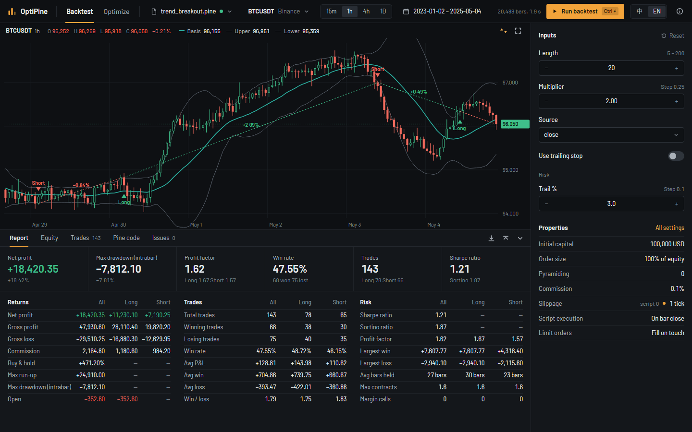

<div align="center">

# OptiPine

**Backtest and optimize TradingView Pine Script strategies offline, with numbers verified against TradingView's own exports.**

[](https://gammaexpansion.github.io/OptiPine/)

No install or sign-up: scripts and backtests run entirely in your browser.

[](https://github.com/GammaExpansion/OptiPine/actions/workflows/ci.yml)
[](LICENSE)

[English](README.md) · [简体中文](README.zh-CN.md)

</div>

[](https://gammaexpansion.github.io/OptiPine/ 'Try OptiPine in your browser')

> **Status.** The engine, optimizer and browser app run locally, including walk-forward in the app.

## Why this exists

If you write strategies in Pine Script you know the loop: change an input, wait for the Strategy
Tester, write the number down, repeat. TradingView has no parameter optimizer, and rewriting a
strategy in Python means trusting that your port behaves like the original.

OptiPine runs your Pine source as it is. Give it a v5 or v6 strategy and market data, and search
its inputs across thousands of combinations with the validation methods quants actually use.
Every part of the engine is checked against exports from TradingView itself, so the equity curve
you optimize is the one you would see on the chart.

## What you get

- **A browser workbench.** Charts with plots and trades, reports, equity and editable inputs, in
  English and Chinese. Backtest and Optimize both support desktop, tablet and phone. Scripts and
  calculations stay in your browser; your scripts never leave your machine. Optimization views
  update as trials finish: summary charts, a leaderboard, parameter maps and sensitivity, with
  preview and apply for any selected set.
- **Your Pine, unchanged.** Indicators and strategies in v5 and v6: `ta.*`, `math.*`, `str.*`,
  arrays, matrices, maps, enums, orders and exits, risk limits, commission, slippage and sessions.
- **A real optimizer.** Grid or random search over every input type, booleans and option lists
  included. Constraints such as a minimum number of trades or a maximum drawdown filter the
  leaderboard.
- **Overfitting checks built in.** In-sample / out-of-sample splits, walk-forward with rolling or
  anchored windows, parameter heatmaps, sensitivity and neighbourhood averages that reward stable
  regions rather than lucky cells. Run walk-forward in the app to inspect stitched OOS equity,
  per-window results and parameter stability, or use the packages in your own code.
- **Numbers you can trust.** 240 fixtures captured from TradingView, more than 45 million plot
  values, trade fields and report metrics compared cell by cell on every commit.
- **Runs where JavaScript runs.** The engine has no filesystem or network dependency and works in
  Node or a browser; `@pine/workers` spreads a search across an adaptive Web Worker pool.
- **Market data included.** Binance spot and perpetuals and Yahoo Finance through a small Node
  proxy, plus CSV files.

## See it

These images render the [design mock](docs/web-mock-terminal), which the app follows.

[](docs/screenshots/optimize.png)

A 2,214-set grid search shows the leading equity curves, IS / OOS results, a parameter map
and the selected set ready to preview or apply.

[](docs/screenshots/walk-forward.png)

Six rolling windows show stitched out-of-sample equity, each window's selected parameters and
their stability across windows.

[](docs/screenshots/equity.png)

The Equity tab puts the account curve, drawdown, daily P&L and monthly returns on a shared timeline.

[Regenerate the images](docs/screenshots/README.md) from the mock boards.

## Running the app

The [online demo](https://gammaexpansion.github.io/OptiPine/) needs no install; it loads Binance
spot data and CSV files. Run the app locally for Yahoo Finance and USDⓈ-M perpetual data.

Requires [Node.js](https://nodejs.org) 24.5 or newer.

```sh
git clone https://github.com/GammaExpansion/OptiPine.git
cd OptiPine
npm ci && npm run build
npm run dev -w @pine/web
```

Open the URL printed by Vite (normally `http://127.0.0.1:5173`). Click **Load example: Trend
Breakout, BTCUSDT 1 hour**, then **Run backtest**. Switch to **Optimize**, set the search ranges
and press **Start**. To use your own strategy, open a `.pine` file or paste its source, then select
market data or upload a CSV. Example loading and provider data need internet access; calculations
run locally.

To serve the build, run `npm run start -w @pine/web` and open `http://127.0.0.1:5174` (`HOST` and
`PORT` override the address). Dev, preview and production include the market data proxy.
Run `npm run test -w @pine/web` for unit and component tests; after
`npx playwright install chromium`, run `npm run e2e -w @pine/web` for browser tests.

## What is not supported yet

`request.security()` and the other `request.*` calls, Bar Magnifier, `import` of libraries and
currency conversion. Drawings (`label.*`, `line.*`, `box.*`, `table.*`) run as no-ops with a
warning. A script that depends on one of these fails with an explicit diagnostic instead of a
silently wrong number; the [compatibility notes](docs/COMPATIBILITY_NOTES.md) list exactly what
is measured.

## Use the packages in your own code

```ts
import { describe, run, runWithEquity, sweep } from '@pine/engine';
import {
  enumerateGrid,
  generateSearchSpace,
  leaderboard,
  optimizeParameters,
} from '@pine/optimizer';

const input = {
  bars,
  syminfo: { mintick: 0.01, pointvalue: 1, timezone: 'Etc/UTC' },
  timeframe: '60',
};
const result = run(source, input); // plots, trades, report metrics, diagnostics
const trials = sweep(source, input, [{ inputs: { Length: 10 } }, { inputs: { Length: 20 } }]);

// Search the script's own inputs with a 70 / 30 in-sample / out-of-sample split.
const space = generateSearchSpace(describe(source).inputs, {
  ranges: { Length: { from: 10, to: 50, step: 5 } },
});
const summary = optimizeParameters(
  enumerateGrid(space),
  bars,
  (inputs, bars) => runWithEquity(source, { ...input, bars, inputs }),
  { validation: { mode: 'in-out', splitRatio: 0.7 }, objective: { name: 'Net profit' } },
);
const top = leaderboard(summary.trials, { limit: 10 });
```

The engine has no filesystem or network dependency and keeps no state between runs; `describe`
reads a script's inputs, strategy settings and plots without running it. The optimizer adds no
DOM, Worker or network dependency either: you decide where trials run, and its errors carry stable
codes for your own interface to translate. See [packages/engine/README.md](packages/engine/README.md)
and [packages/optimizer/README.md](packages/optimizer/README.md).

To build an interface, [`@pine/workers`](packages/workers/README.md) runs the engine and the
analysis in Web Workers with cancellation and an adaptive optimization pool, and
[`@pine/market-data`](packages/market-data/README.md) loads Binance and Yahoo bars through a small
Node proxy and parses CSV files.

## For developers

| Path                   | Package             | Contents                                                                 |
| ---------------------- | ------------------- | ------------------------------------------------------------------------ |
| `packages/engine`      | `@pine/engine`      | Pine v5 / v6 compiler, interpreter and broker emulator                   |
| `packages/optimizer`   | `@pine/optimizer`   | Search spaces, validation splits, walk-forward and result analysis       |
| `packages/market-data` | `@pine/market-data` | Binance and Yahoo feeds, the proxy middleware, CSV and profile files     |
| `packages/workers`     | `@pine/workers`     | Engine and analysis Workers and the optimization pool                    |
| `packages/messages`    | `@pine/messages`    | Plain-data text and coded errors shared by the packages                  |
| `packages/golden`      | `@pine/golden`      | TradingView fixtures, the comparison harness and the regression baseline |
| `apps/cli`             | `@pine/cli`         | Fixture runner behind `npm run golden` and `npm run check`               |
| `apps/web`             | `@pine/web`         | Bilingual browser app, charts, backtesting and live optimization         |

```sh
npm run test --workspaces   # packages, CLI and browser app
npm run golden              # run every TradingView fixture
npm run check               # the regression gate CI enforces
```

`npm run check` replays the TradingView fixtures and compares them with the accepted baseline;
it takes a few minutes.

- [Engine design](docs/DESIGN.md), [compatibility notes](docs/COMPATIBILITY_NOTES.md) and the
  [web interface design](docs/WEB.md)
- [How fixtures are collected](packages/golden/fixtures/docs/collecting-golden-sop.md) and the
  [fixture documentation](packages/golden/fixtures/README.md)
- Pull requests are welcome. A change in engine behaviour needs a fixture with native TradingView
  exports; expected values are never edited by hand and tolerances are never widened to pass.

## Support the project

If OptiPine saves you an afternoon of manual re-runs, a star helps other Pine users find it.
Missing a builtin your strategy needs? Open an issue with a minimal script.

## License

[MIT](LICENSE).

TradingView and Pine Script are trademarks of TradingView, Inc. This project is independent and
not affiliated with or endorsed by TradingView. Fixture data consists of the maintainer's own
chart and report exports, used solely to verify compatibility. Nothing here is investment advice.
