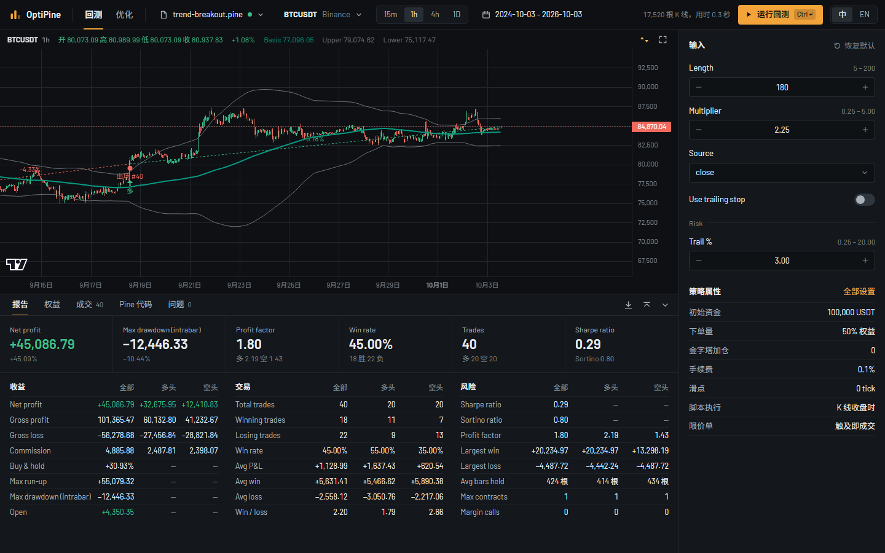
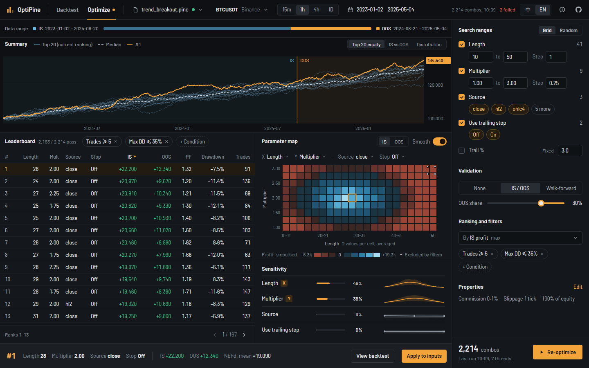
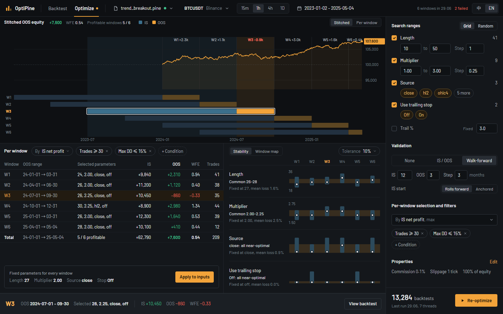
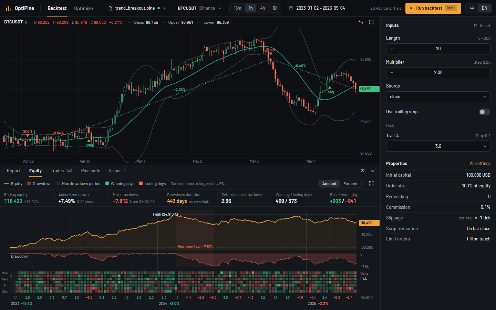

<div align="center">

# OptiPine

**离线回测、优化你的 TradingView Pine Script 策略，结果与 TradingView 自己的导出逐格核对。**

[](https://github.com/GammaExpansion/OptiPine/actions/workflows/ci.yml)
[](LICENSE)

[English](README.md) · [简体中文](README.zh-CN.md)

</div>

[](docs/screenshots/backtest-zh.png)

> **当前状态。** 引擎、优化器和浏览器应用均可在本地运行，应用已支持 walk-forward（滚动优化）。

> **[在线试用](https://gammaexpansion.github.io/OptiPine/)。** 静态演示版在浏览器中运行脚本、回测、优化并支持上传 CSV，
> 直接从 Binance 加载现货数据。Yahoo Finance 和 USDⓈ-M 永续合约需要按照[运行应用](#运行应用)中的说明自托管服务器。

## 为什么做这个

写过 Pine 策略的人都熟悉这个循环：改一个参数，等策略测试器跑完，把数字抄下来，再改一个。
TradingView 没有参数优化器；把策略改写成 Python 又意味着你得相信移植版和原版行为一致。

OptiPine 直接运行你的 Pine 源码。提供一个 v5 或 v6 策略和行情数据，即可用量化研究里真正
在用的验证方法搜索成千上万组参数。引擎的每个部分都用 TradingView 自己的导出核对过，你优化的
那条权益曲线就是图表上会看到的那条。

## 你能得到什么

- **浏览器工作台。** 图表叠加策略绘图与成交标记，配有报告、权益和可编辑的输入参数，支持中英文，
  回测与优化两页均适配桌面、平板和手机。脚本和计算都留在浏览器中，源码不会离开你的机器。优化时，汇总图、排行、
  参数图和敏感度随试验完成实时更新，选中一组参数即可预览回测或应用到输入。
- **Pine 原样运行。** v5 与 v6 的指标和策略：`ta.*`、`math.*`、`str.*`、数组、矩阵、map、枚举、
  下单与退出、风险限制、手续费、滑点和交易时段。
- **真正的优化器。** 网格或随机搜索覆盖所有输入类型，布尔和选项列表也算轴。最少成交数、最大
  回撤等约束直接过滤排行。
- **内置过拟合检查。** 样本内 / 样本外切分，滚动或锚定窗口的 walk-forward，参数热力图、敏感度
  分析，以及奖励稳定区域而不是幸运格子的邻域平均。可在应用中运行 walk-forward，查看拼接的样本外权益、
  各窗口结果与参数稳定性，也可在自己的代码中调用这些包。
- **可信的数字。** 240 个从 TradingView 采集的 fixture，超过 4500 万个绘图值、成交字段和报告
  指标，每次提交都逐格比对。
- **随处运行。** 引擎不依赖文件系统和网络，可在 Node 或浏览器中运行；`@pine/workers` 将一次
  搜索分配到自适应的 Web Worker 线程池。
- **自带行情数据。** 经由一个小型 Node 代理获取 Binance 现货与永续、Yahoo Finance 行情，并支持
  CSV 文件。

## 看看界面

这些图片由应用所遵循的[设计稿](docs/web-mock-terminal)渲染而成。

[](docs/screenshots/optimize.png)

2,214 组参数的网格搜索展示领先的权益曲线、样本内 / 样本外结果和参数图，选中的参数可预览或应用。

[](docs/screenshots/walk-forward.png)

六个滚动窗口展示拼接的样本外权益、各窗口选定的参数，以及参数在窗口之间的稳定性。

[](docs/screenshots/equity.png)

权益页签把账户曲线、回撤、每日盈亏和月度收益放在同一条时间轴上。

可从设计稿[重新生成图片](docs/screenshots/README.md)。

## 运行应用

需要 [Node.js](https://nodejs.org) 24.5 或更新版本。

```sh
git clone https://github.com/GammaExpansion/OptiPine.git
cd OptiPine
npm ci && npm run build
npm run dev -w @pine/web
```

打开 Vite 输出的地址（通常是 `http://127.0.0.1:5173`），点击**载入示例：Trend Breakout，
BTCUSDT 1 小时**，再点击**运行回测**。切换到**优化**，设置搜索范围后点击**开始优化**。
使用自己的策略时，打开 `.pine` 文件或粘贴源码，再选择行情或上传 CSV。载入示例和获取行情需要联网，
计算在本地完成。

运行 `npm run start -w @pine/web` 可在 `http://127.0.0.1:5174` 提供构建产物（用 `HOST` 和
`PORT` 覆盖地址）；开发、预览及生产服务都包含行情代理。
`npm run test -w @pine/web` 运行单元与组件测试；执行 `npx playwright install chromium` 后，
用 `npm run e2e -w @pine/web` 运行浏览器测试。

## 目前不支持的

`request.security()` 等 `request.*` 调用、Bar Magnifier、`import` 库和货币换算。绘图类调用
（`label.*`、`line.*`、`box.*`、`table.*`）会作为空操作执行并给出警告。依赖这些功能的脚本会得到
明确的诊断，而不是一个悄悄算错的数字；[兼容性说明](docs/COMPATIBILITY_NOTES.md) 列出了具体
测量了什么。

## 在你自己的代码里使用这些包

```ts
import { describe, run, runWithEquity, sweep } from '@pine/engine';
import {
  enumerateGrid,
  generateSearchSpace,
  leaderboard,
  optimizeParameters,
} from '@pine/optimizer';

const input = {
  bars,
  syminfo: { mintick: 0.01, pointvalue: 1, timezone: 'Etc/UTC' },
  timeframe: '60',
};
const result = run(source, input); // plots、trades、报告指标、diagnostics
const trials = sweep(source, input, [{ inputs: { Length: 10 } }, { inputs: { Length: 20 } }]);

// 按 70 / 30 的样本内 / 样本外切分，搜索脚本自身的输入参数。
const space = generateSearchSpace(describe(source).inputs, {
  ranges: { Length: { from: 10, to: 50, step: 5 } },
});
const summary = optimizeParameters(
  enumerateGrid(space),
  bars,
  (inputs, bars) => runWithEquity(source, { ...input, bars, inputs }),
  { validation: { mode: 'in-out', splitRatio: 0.7 }, objective: { name: 'Net profit' } },
);
const top = leaderboard(summary.trials, { limit: 10 });
```

引擎不依赖文件系统和网络，运行之间不保留状态；`describe` 在不运行脚本的前提下读取其输入参数、
策略设置与绘图。优化器同样不依赖 DOM、Worker 和网络：试验在哪里运行由调用方决定，错误附带稳定
的错误码，由你自己的界面负责翻译。详见 [packages/engine/README.md](packages/engine/README.md) 与
[packages/optimizer/README.md](packages/optimizer/README.md)。

如需构建界面，[`@pine/workers`](packages/workers/README.md) 在 Web Worker 中运行引擎与分析，
提供取消与自适应的优化线程池；[`@pine/market-data`](packages/market-data/README.md) 经由一个小型
Node 代理载入 Binance 与 Yahoo 行情，并解析 CSV 文件。

## 给开发者

| 路径                   | 包                  | 内容                                                      |
| ---------------------- | ------------------- | --------------------------------------------------------- |
| `packages/engine`      | `@pine/engine`      | Pine v5 / v6 编译器、解释器与撮合模拟器                   |
| `packages/optimizer`   | `@pine/optimizer`   | 搜索空间、验证切分、walk-forward 与结果分析               |
| `packages/market-data` | `@pine/market-data` | Binance 与 Yahoo 行情源、代理中间件、CSV 与配置文件       |
| `packages/workers`     | `@pine/workers`     | 引擎与分析 Worker、优化线程池                             |
| `packages/messages`    | `@pine/messages`    | 各包共用的纯数据文本与带错误码的错误                      |
| `packages/golden`      | `@pine/golden`      | TradingView fixture、比对框架与回归基线                   |
| `apps/cli`             | `@pine/cli`         | `npm run golden` 与 `npm run check` 背后的 fixture 运行器 |
| `apps/web`             | `@pine/web`         | 中英文浏览器应用、图表、回测与实时优化视图                |

```sh
npm run test --workspaces   # 所有包、CLI 与浏览器应用的测试
npm run golden              # 跑完整的 TradingView fixture 套件
npm run check               # CI 执行的同一道回归门禁
```

`npm run check` 重放 TradingView fixture，并与已接受的基线比对，耗时数分钟。

- [引擎设计](docs/DESIGN.md)、[兼容性说明](docs/COMPATIBILITY_NOTES.md) 与 [Web 界面设计](docs/WEB.md)
- [fixture 采集流程](packages/golden/fixtures/docs/collecting-golden-sop.md) 与
  [fixture 文档](packages/golden/fixtures/README.md)
- 欢迎提交 PR。改变引擎行为需要附带 TradingView 原生导出的 fixture；期望值不手改，也不为了
  通过而放宽容差。

## 支持这个项目

如果 OptiPine 帮你省下了一下午手动重跑的时间，点一颗星能让更多 Pine 用户找到它。缺少你策略
需要的内置函数？带一个最小脚本开 issue。

## 许可证

[MIT](LICENSE)。

TradingView 与 Pine Script 是 TradingView, Inc. 的商标。本项目独立开发，与 TradingView 没有关联，
也未获其背书。fixture 数据是维护者自己的图表与报告导出，仅用于核对兼容性。本项目不构成任何
投资建议。
